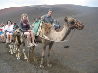

##Der Bus

We have arranged a vintage bus for the day, and will be able to transport some guests after the wedding ceremony to the South Farm reception venue (see [locations](\locations.html)). 

Unfortunately capacity is limited, and places will be allocated on a first come, first serve basis, so if you would like a free ride please contact us ASAP! 

##Train

The closest train station to the church is Cambridge Train Station. It's quite a walk from there to the church so we suggest you get a taxi across Cambridge.

The closest train station to South Farm is Royston. From there you will need to get a taxi. They frequent the station quite regularly, except when they don't.

This brings us neatly on to the subject of (beware Joe is about to rant)...

##Taxis

Butler-Meltax (they merged) basically have a monopoly on all taxis in Royston. They are expensive and can take up to an hour to arrive when booked last minute.

On the other hand, there are a plethora of taxi firms in Cambridge, which can get to South Farm in much less time than a Butler-Meltax taxi (from Royston!), and will charge something like ~£25 to take you all the way back to Cambridge. Forget getting the train from Cambridge to Royston and back (last train is around midnight). If you are sharing, this price is much less than the price of a rail ticket, and you don't have to interchange.

Since South Farm is in the middle of nowhere, we would, however, suggest you book your evening taxi back to your accommodation ahead of time. Charlotte tends to use A1 as they have a handy app - their number along with a few others is included below:

* [A1 Cabco](http://www.a1cabco.co.uk/) 01223 525555
* [Cam Cab Ltd](http://camcab.co.uk) 01223 704704
* [Panther Taxis](http://www.panthertaxis.co.uk) 01223 715715 
* [LP Taxis](http://lptaxis.co.uk) 01223 243453
